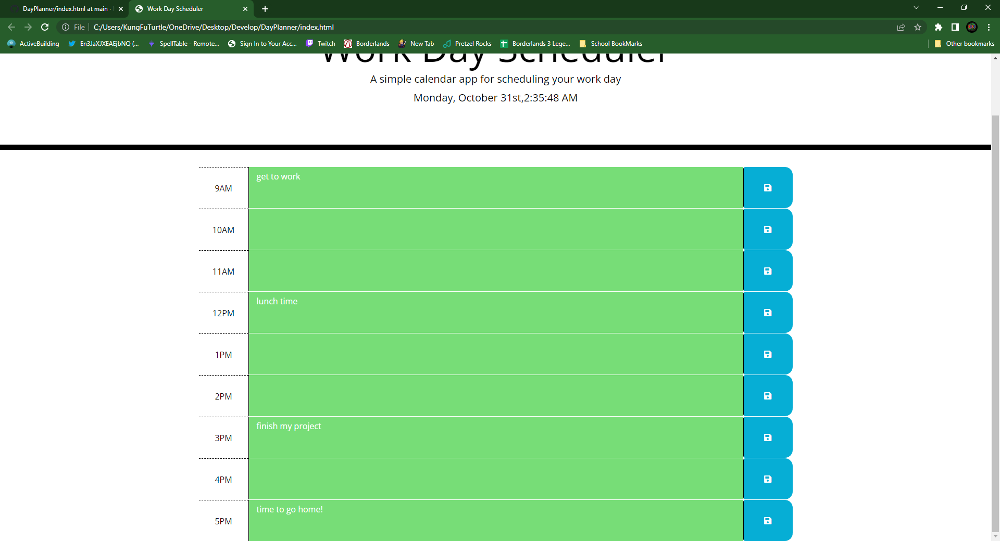

# DayPlanner
Using jquary I made a working day planner that saves text input to local storage. To clear text just simply hit the save button on empty text input. 

## Picture for project

## Website
[DayPlanner](https://mfischerturtle.github.io/DayPlanner)